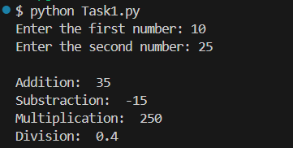
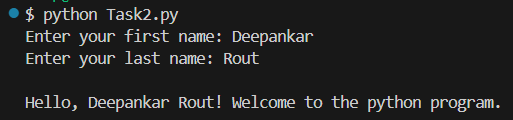

# Assignemnt - 1 ( Module 2: Basic Python Concepts )

1. Check Task1.py and Task2.py file.
2. Run Task1.py for "Perform Basic Mathematical Operations" code.
    ### Output
    

3. Run Task2.py for "Create a Personalized Greeting" code.
   ### Output
    