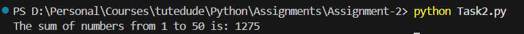

# Assignemnt - 2 ( Module 3: Control Structures in Python )

1. Check Task1.py and Task2.py file.
2. Run Task1.py for "Check if a Number is Even or Odd" code.
    ### Output
    

3. Run Task2.py for "Sum of Integers from 1 to 50 Using a Loop" code.
   ### Output
   